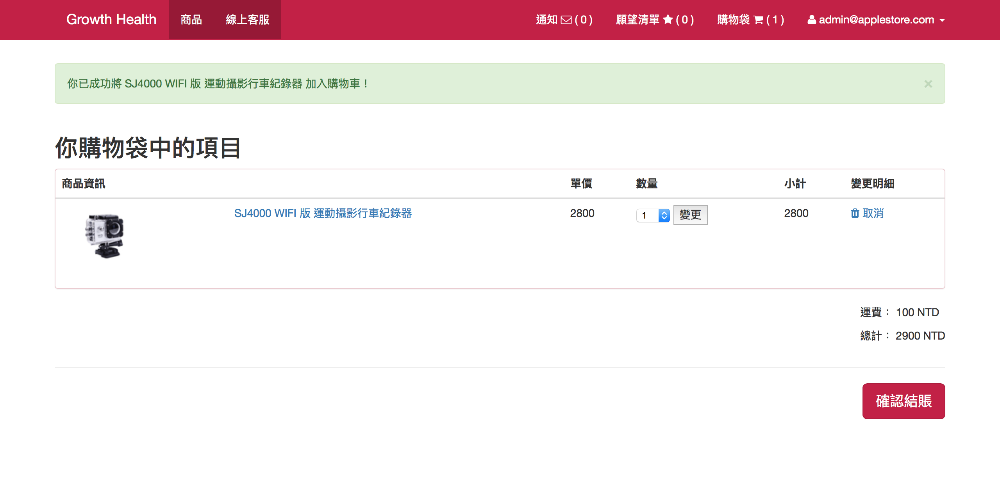
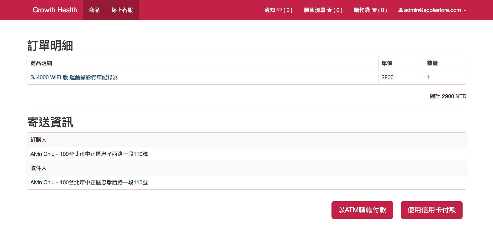

# Applestore

這是一款簡單易用、功能齊全的購物車系統。功能特色如下：

* 商品狀態控管，讓商品依照狀態顯示於首頁（上架、下架、不公開的販售）
* 提供智付寶線上刷卡機制
* 庫存控管，可依據銷售策略與貨源決定商品數量是否有數量限制
* 運費策略，可決定免運費資格
* 提供Facebook帳號登入
* 缺貨物件可加入許願清單，供賣方參考
* 彈性的商品敘述，可依據需求彈性調整文案
* 可設定限時優惠，在個別商品頁面顯示倒數計時
* [ER-Diagram](https://github.com/AlvinChiou/applestore/blob/master/erd.pdf)

## Screen Shots
---

